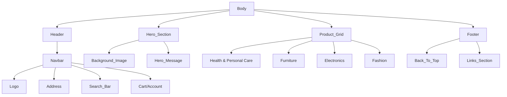
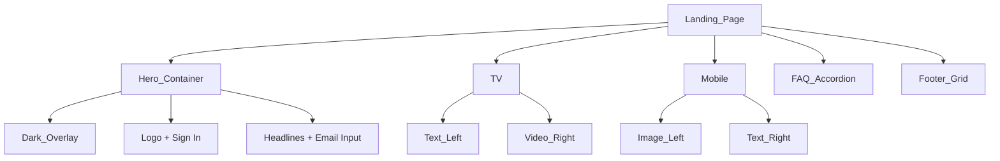

# ChaiCode Dev Cohort 🚀

> *"Coding with chai, one line at a time."* ☕💻

Welcome to my official portfolio for the **ChaiCode Dev Cohort**! This repository is more than just code; it's a documentation of my journey from understanding the building blocks of the web to crafting high-fidelity, pixel-perfect experiences.

Here, you'll find everything from my first semantic HTML experiments to complex clones of major platforms like Amazon and Netflix. Every commit represents a lesson learned, a bug squashed, and a step forward.

---

## 🌟 Featured Projects

### 1. [Mintlify Clone (Light Mode)](./mintlify_clone/)
 
A pixel-perfect recreation of the Mintlify intelligent documentation platform.

-   **The Challenge**: Transforming a complex, dark-mode heavy design into a premium "Verse" light theme while maintaining visual hierarchy.
-   **Key Learnings**:
    -   Mastering **CSS Grid** for intricate layouts.
    -   Implementing **Sticky Navbars** with `backdrop-filter` for that "glassmorphism" feel.
    -   Using **3D Transforms** to create a tilted, interactive code editor window.
-   **Highlight**: The custom-built "Floating Documentation Preview" – a purely CSS-driven component that mimics interactive documentation.

### 2. [Cursor Landing Page](./cursor_landing_clone/)
 
A clone of the AI Code Editor "Cursor" landing page.

-   **The Challenge**: Capturing the subtle, glowing aesthetic of modern developer tools.
-   **Key Learnings**:
    -   Advanced **Flexbox centering** techniques.
    -   Creating smooth **Gradient Text** effects.
    -   Structuring dark UI patterns for readability.

### 3. [Bharat CV (Special Project)](./Bharat_CV/)
 
A professional, print-ready CV designed for my father, **Bharat Narula** (Senior Chemistry Faculty).

-   **The Goal**: To distill 20+ years of teaching excellence into a sophisticated, "Compact Terra Cotta" design.
-   **Key Learnings**:
    -   **Print Media Queries** (`@media print`) to control page breaks and hide interactive elements.
    -   Typography hierarchy for maximum readability on A4 paper.
-   **Sincere Touch**: This project is close to my heart, blending technical skill with personal gratitude.

---

## 🛠️ Deep Dive: The Clones

### 7. [Amazon Clone](./SELF%20PRACTICE/Amazon%20Clone/)
 

A responsive recreation of the Amazon homepage. This project was a deep dive into layout stability and content organization.

**Site Architecture:**

-   **Challenges Faced**:
    -   **The Navbar**: Amazon's navbar is packed with information. Using `flexbox` with `justify-content: space-evenly` allowed me to distribute elements proportionally without overcrowding.
    -   **Responsive Images**: Ensuring product images scaled correctly within their cards without stretching.
-   **Key Learnings**: The power of `position: relative` and `absolute` in identifying and layering content on top of hero images.

### 8. [Netflix Clone](./SELF%20PRACTICE/Netflix%20Clone/)
 

A responsive clone of the Netflix India landing page, focusing on high-contrast visuals and bold typography.

**Site Architecture:**

-   **Challenges Faced**:
    -   **Z-Index Management**: Layering the dark overlay *on top* of the background image but *below* the text was tricky. I used `position: absolute` with specific `z-index` values to stack them correctly.
    -   **Video Placement**: Positioning the "autoplay" videos exactly inside the TV/Device frames required precise percent-based positioning.
-   **Key Learnings**: How simply `padding` and `margin` can create a spacious, cinematic feel, and how crucial **typography** (Poppins/Martel Sans) is to brand identity.

---

## 📂 Coursework Archive

| Directory | Description | Focus Area |
|-----------|-------------|------------|
| `mintlify_clone/` | **Assignment 2** | Advanced Layouts, 3D Transforms |
| `cursor_landing_clone/` | **Cursor Clone** | Dark UI, Gradients |
| `ASSIGNMENT-1/` | **Resume HTML** | Semantic Structure |
| `CLASS-02/` | **Nav & Flexbox** | Flexbox Fundamentals |
| `CSS/` | **Experiments** | Property Playground |
| `SELF PRACTICE/` | **Sandbox** | HTML/CSS Drills (Lists, Media, Forms) |

---

## 💡 About Me

I am **Sonam Narula**, a passionate developer building my skills one project at a time. This repository is my digital sketchbook—a place where code meets creativity.

*Always learning, always coding.*

---
© 2026 Sonam Narula. All Rights Reserved.
