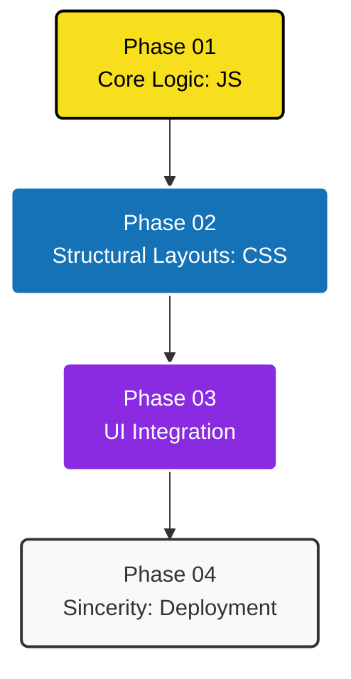
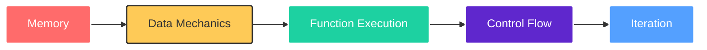
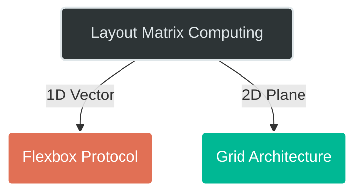
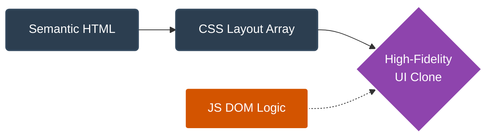
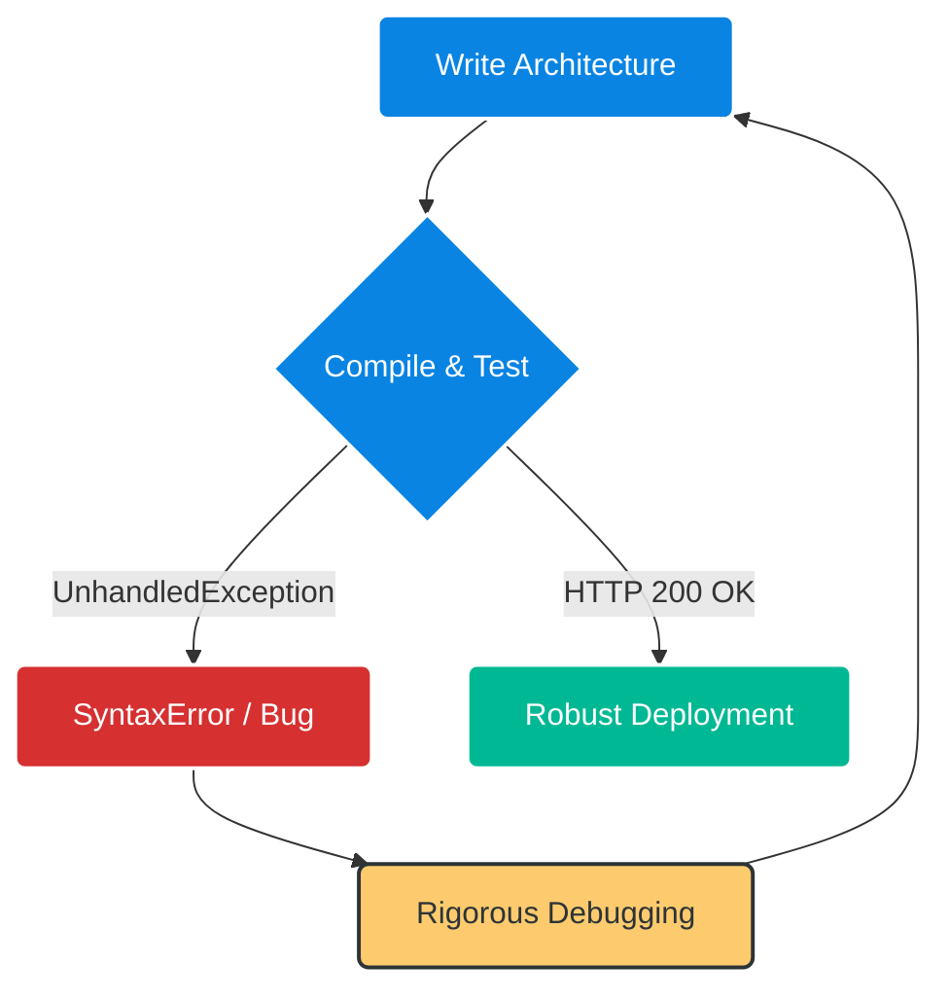

# The ChaiCode Developer Cohort
> *"Long story short, I code."* 🦋

---

## ▎System Initialization

Welcome to my digital workspace. 

I approach software engineering with a simple philosophy: **quiet, absolute focus.** I prefer my commit history to speak for my discipline, and my code to demonstrate my understanding.

Growth happens in the quiet, late-night hours of debugging a flawed algorithm or rebuilding a broken layout from scratch. It is about showing up daily and meticulously building a resilient architecture—one line, one function, one module at a time. This repository is the live documentation of that relentless work. 🛠️

---

## ▎Curriculum & Execution Phases

My technical growth is structured into foundational phases. Below is the systematic index of all modules deployed in this repository.

 

### Phase 01: Core Logic (JavaScript)
The heartbeat of the system. This phase is a rigorous deep dive into the invisible logic that drives applications.

| Conceptual Focus | Modules & Scripts | Technical Implementations |
| :--- | :--- | :--- |
| **Memory & Syntax** | [Advanced Console Logging](./JAVASCRIPT/BASICS%20-%202/01-console.js) [Variables Intro](./JAVASCRIPT/BASICS%20-%202/02-variables.js) [Console Methods Demo](./JAVASCRIPT/console.js) | Lexical environments, strict `var/let/const` memory allocation, structured console APIs (`table`, `time`, `group`). |
| **Data Mechanics** | [Data Types Advanced](./JAVASCRIPT/BASICS%20-%202/03-datatypes.js) | Primitive vs reference types, `typeof` identification, execution of 11 distinct operator categories (`??`, `?.`, `...`). |

 

### Phase 02: Structural Layouts (CSS)
Diving into spatial geometry and layout matrix computing, strictly without pre-built UI library assistance.

| Layout Protocol | Modules & Deployments | Technical Implementations |
| :--- | :--- | :--- |
| **1D Alignment** | [Flexbox Laboratory](./SELF%20PRACTICE/CSS/flexbox.html) | Single-axis management, spatial distribution (`justify-content`), cross-axis positioning. |
| **2D Architecture** | [Grid System](./SELF%20PRACTICE/CSS/grid.html) | Complex multi-axis alignment, explicit grid tracks, responsive fractions (`fr`), template areas. |
| **Spatial Overrides** | [CSS Positions](./SELF%20PRACTICE/CSS/level3.html) [Sticky/Fixed Playground](./SELF%20PRACTICE/CSS/Practice%20Set%20-%205/index.html) | Explicit layout manipulation via `static`, `relative`, `absolute`, `fixed`, and `sticky` positioning techniques. |

 

### Phase 03: UI Integration (Architecture)
Integration testing via high-fidelity interface cloning. Demands strict structural validation and pixel-perfect rendering.

| Project Clone | Focus Area | Technical Implementations |
| :--- | :--- | :--- |
| **[Mintlify Clone](./mintlify_clone/)** | Desktop-First Light UI | Advanced CSS layouts (Grid, Flexbox), custom CSS variables, complex background integrations. |
| **[Cursor Landing Page](./cursor_landing_clone/)** | Dark-Mode Premium UI | Custom `-webkit-background-clip` text gradients, glassmorphism UI, semantic HTML5. |
| **[Amazon Interface](./SELF%20PRACTICE/Amazon%20Clone/)** | E-Commerce Layouts | Complex component structuring, responsive headers, multi-tier navigation logic. |
| **[Netflix Interface](./SELF%20PRACTICE/Netflix%20Clone/)** | Fluid Media Grids | Dynamic `vw/vh` scaling, responsive image grids, absolute/relative element stacking. |

 

### Phase 04: Sincerity (Special Project)
Technical skills require meaningful application. 

| Project | Purpose & Execution |
| :--- | :--- |
| **[Bharat CV](./Bharat_CV/)** | Engineered for my father, a Chemistry teacher of 20+ years. Built with clean typography and print-optimized structure. It is an exercise in sincere gratitude—giving back to the person who gave me everything. 🤍 |

---

## ▎Developer Diagnostics

I am building this path step by step. I am not rushing the process, nor am I taking shortcuts. 

| Diagnostic Metric | Current State |
| :--- | :--- |
| **Vulnerability** | Wondering if my current technical stack is deep enough for the ambitions I carry. |
| **Grounding Reality** | Incremental optimization. Showing up. Pushing commits. Proving dedication through consistent work. |
| **Core Algorithm** | Every failed build and `SyntaxError` I wrestle with teaches me how to write a more robust system. Breaking the code is the only way I learn how to build it. |

 

### ▎Execution Log 

   

  <!-- Animated Diagnostic Loader -->
  

    

  <!-- Animated Contribution Activity Graph -->
  

    

  <!-- Streaks & Language Compute -->
  
  
  
    
  
  <!-- Execution Trophies -->
  

 

*(c) 2026 Sonam Narula. Let the execution speak.* 🏏
