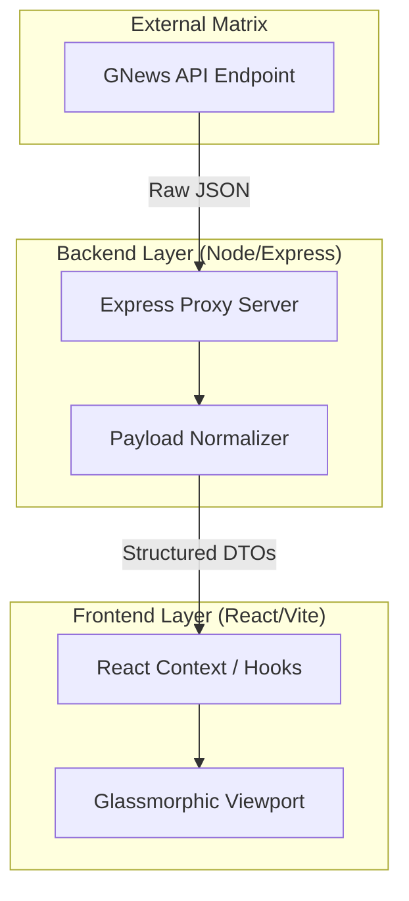

# 🧠 ChaiCode Dev Cohort — Cognitive Flight Deck

<div align="center">
  
  
  
  
</div>

<p align="center"><strong>Ship fast. Measure. Explain. Refine.</strong></p>

<p align="center">
  
</p>

<p align="center"><em>"Average devs follow tutorials. High-signal devs build universes."</em></p>

## 🔬 Executive Snapshot
- **Prime build:** NeuroNews — React/Vite/TS + Express proxy, glassmorphic UI, infinite scroll, bookmarks, dark mode, demo-safe.
- **Second brain:** JS Lab chapters (01–08) run in the console via `JAVASCRIPT/index.html` — backed by `JS_Learn_Everything.pdf`.
- **Cold start:** `npm install && npm run dev` → UI on 5173, API proxy on 5001 (`backend/.env` needs `GNEWS_API_KEY`).

### ✨ Highlights
- Keyboard-friendly flows, glassmorphism, and a reading-time heuristic.
- API keys never touch the client; proxy sanitizes payloads + CORS.
- Demo mode auto-switches when rate limits shout.

---

## 📂 Directory Matrix

| Path | Purpose | Character |
| :--- | :--- | :--- |
| **`frontend/`** | NeuroNews client | React • Vite • TS • Tailwind |
| **`backend/`** | News proxy | Express • DTO sanitization • CORS shield |
| **`api/`** | Serverless bridge | Vercel-style endpoints |
| **`JAVASCRIPT/`** | JS Lab | Chapters 01–08 + source PDF |
| **`HTML/` · `CSS/`** | Fundamentals | Structured markup & layout drills |
| **`nike-store/`** | Commerce sandbox | Transactional UI & flows |
| **`swiftmind/`** | AI R&D | Conversational interfaces |
| **`mintlify_clone/`, `cursor_landing_clone/`** | Perception drills | High-fidelity UI recreations |

---

## 📐 NeuroNews Architecture

```mermaid
graph TD
    subgraph "External Matrix"
        API["GNews API Endpoint"]
    end

    subgraph "Backend Layer (Node/Express)"
        Proxy["Express Proxy Server"]
        Sanitizer["Payload Normalizer"]
    end

    subgraph "Frontend Layer (React/Vite)"
        State["React Context / Hooks"]
        UI["Glassmorphic Viewport"]
    end

    API -->|Raw JSON| Proxy
    Proxy --> Sanitizer
    Sanitizer -->|Structured DTOs| State
    State --> UI
```

---

## 🛠 System Ignition

```bash
# Install once at root
npm install

# Backend env
cat > backend/.env <<'EOF'
PORT=5001
GNEWS_API_KEY=YOUR_GNEWS_KEY_HERE
EOF

# Run both tiers
npm run dev
# UI: http://localhost:5173  |  API: http://localhost:5001
```

### 🎓 JS Lab (Console-first)
Open `JAVASCRIPT/index.html` in a browser or Live Server → DevTools Console.  
Chapters: 01 Variables · 02 Data Types · 03 Operators · 04 Control Flow · 05 Loops · 06 Functions & Closures · 07 Arrays · 08 Objects (source PDF: `JS_Learn_Everything.pdf`).

---

## 📉 System Diagnostics

```text
SONAM-NARULA.dev :: runtime diagnostics
------------------------------------------------------------
learning_rate          : aggressive
attention_to_detail    : unreasonably high
design_sensitivity     : calibrated
debugging_style        : forensic
tolerance_for_sloppy_ui: none
relationship_with_bugs : adversarial but educational
mission                : turn effort into craftsmanship
```

<p align="center">
<em>while (alive) { learn(); build(); refine(); }</em>
</p>
