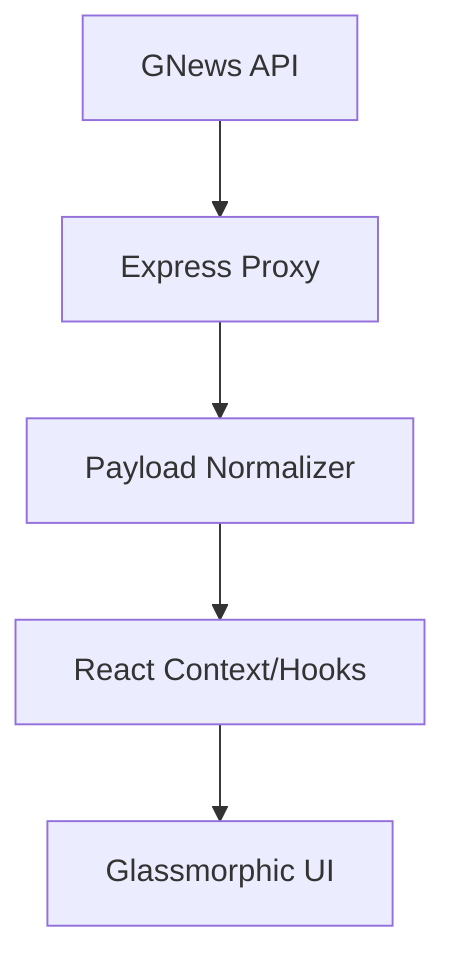
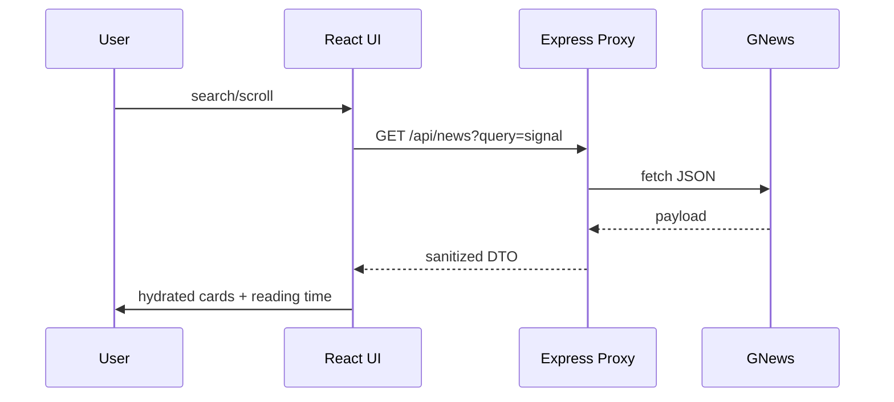

# ChaiCode Dev Cohort — Build Log & Playground

[](#)
[](#)
[](#)

> A personal R&D hangar: quick experiments, polished builds, and the patterns that connect them.

---

## TL;DR
- **Prime project:** **NeuroNews** — glassmorphic news app (React/Vite/TS + Express proxy) with category filters, search, bookmarks, dark mode, and rate-limit safe demo mode.
- **Skill tracks:** UI cloning, commerce flows, AI chats, and a console-first JS lab (8 chapter files linked below).
- **Zero-to-running:** `npm install && npm run dev` (frontend 5173, backend 5001) — add your `GNEWS_API_KEY` in `backend/.env`.

---

## What’s Inside
| Path | Purpose |
| --- | --- |
| `frontend/` | NeuroNews UI (React/Vite/TS, Tailwind) |
| `backend/` | Express proxy (CORS/key shielding, DTO cleanup) |
| `api/` | Vercel-ready serverless handlers mirroring the proxy |
| `news-aggregator/` | Legacy combined build kept for reference |
| `JAVASCRIPT/` | Console-first chapter pack (`01`–`08`) + source PDF |
| `HTML/`, `CSS/` | Fundamentals & layout drills |
| `mintlify_clone/`, `cursor_landing_clone/` | Visual perception practice |
| `nike-store/` | Full-stack commerce sandbox |
| `swiftmind/` | Conversational AI playground |

---

## Quick Start
```bash
# 1) Install root deps
npm install

# 2) Backend env
cat > backend/.env <<'EOF'
PORT=5001
GNEWS_API_KEY=YOUR_GNEWS_KEY_HERE
EOF

# 3) Run both servers
npm run dev
# UI: http://localhost:5173  |  API proxy: http://localhost:5001
```

### JS Lab (Console)
Open `JAVASCRIPT/index.html` in a browser or Live Server, then view DevTools → Console to see chapters:
`01` Variables, `02` Data Types, `03` Operators, `04` Control Flow, `05` Loops, `06` Functions & Closures, `07` Arrays, `08` Objects.  
Reference: `JAVASCRIPT/JS_Learn_Everything.pdf`.

---

## NeuroNews Architecture

```mermaid
graph TD
  API["GNews API"] --> Proxy["Express Proxy"]
  Proxy --> Sanitizer["Payload Normalizer"]
  Sanitizer --> State["React Context/Hooks"]
  State --> UI["Glassmorphic UI"]
```

### Data Flow

```mermaid
sequenceDiagram
  participant U as User
  participant F as React UI
  participant B as Express Proxy
  participant E as GNews
  U->>F: search/scroll
  F->>B: GET /api/news?query=signal
  B->>E: fetch JSON
  E-->>B: payload
  B-->>F: sanitized DTO
  F->>U: hydrated cards + reading time
```

---

## Highlights
- **Performance:** Concurrent dev script, proxied API to avoid client key leaks, optional demo mode for rate limits.
- **UX:** Keyboard-friendly feed, dark mode, bookmarks, reading-time heuristic.
- **Engineering habits:** Typed DTOs, guard clauses over nesting, immutable data for UI state.
- **Learning rhythm:** Small console drills graduate into components; clones sharpen visual accuracy before productization.

---

## Collaboration Notes
- Short, runnable steps in PRs; screenshots or clips for UI changes.
- Secrets stay in env files; never in client bundles.
- Prefer typed contracts (TS, DTOs) over doc-only agreements.

---

## Roadmap
- NeuroNews: sentiment tagging + Redis caching; live sockets for headline pulses.
- JS Lab: add perf minis (event loop, GC, async patterns) with flamechart exercises.
- Design system: theme-stable tokens for both light/dark without hacks.

---

```
while (alive) {
  learn();
  build();
  refine();
}
```

*If you skimmed: clone, run `npm run dev`, open the console lessons, and tell me what broke—I fix fast.*
