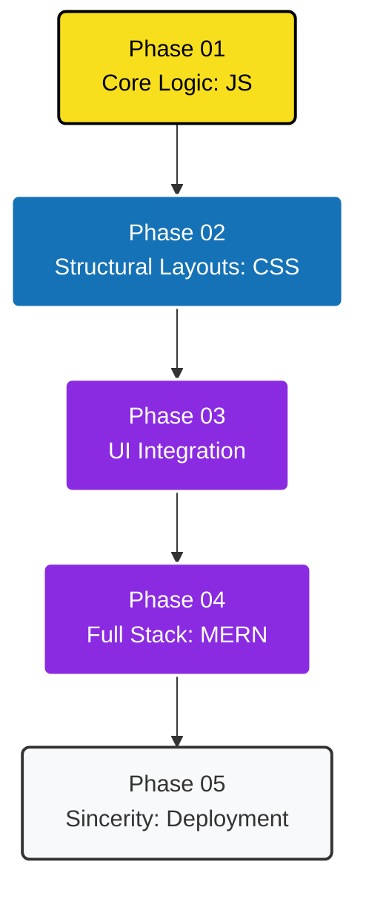
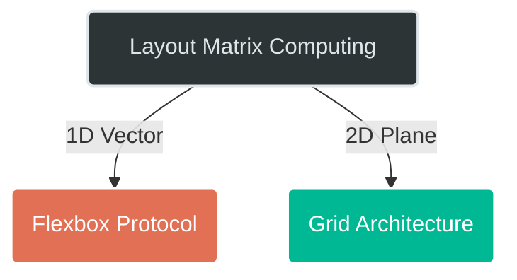
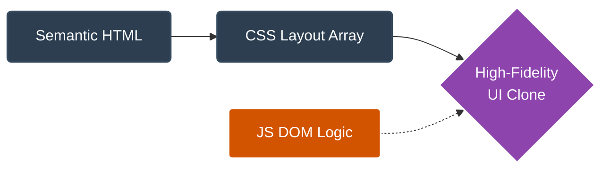
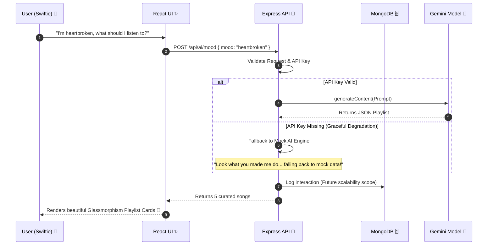
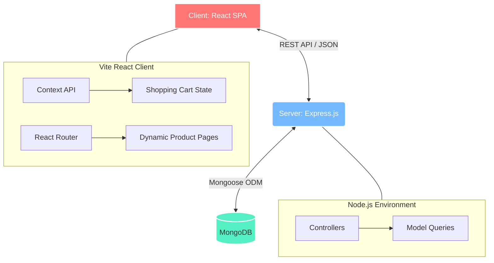

# The ChaiCode Developer Cohort
> *"Long story short, I code."* 🦋

---

## ▎System Initialization

Welcome to my digital workspace. 

I approach software engineering with a simple philosophy: **quiet, absolute focus.** I prefer my commit history to speak for my discipline, and my code to demonstrate my understanding. 

Growth happens in the quiet, late-night hours of debugging a flawed algorithm or rebuilding a broken layout from scratch. It is about showing up daily and meticulously building a resilient architecture—one line, one function, one module at a time. This repository is the live documentation of that relentless work. 🛠️

*(And yes, sometimes it involves staring at a screen for 3 hours only to realize I missed a comma in a JSON object. If you know, you know 🤡)*

---

## ▎Curriculum & Execution Phases

My technical growth is structured into foundational phases. Below is the systematic index of all modules deployed in this repository. 

```mermaid
graph TD
    classDef js fill:#f7df1e,stroke:#000,stroke-width:2px,color:#000,rx:5px,ry:5px;
    classDef css fill:#1572b6,stroke:#fff,stroke-width:2px,color:#fff,rx:5px,ry:5px;
    classDef arc fill:#8a2be2,stroke:#fff,stroke-width:2px,color:#fff,rx:5px,ry:5px;
    classDef sin fill:#f8f9fa,stroke:#333,stroke-width:2px,color:#333,rx:5px,ry:5px;

    A[Phase 01<br/>Core Logic: JS]:::js --> B[Phase 02<br/>Structural Layouts: CSS]:::css
    B --> C[Phase 03<br/>UI Integration]:::arc
    C --> E[Phase 04<br/>Full Stack: MERN]:::arc
    E --> D[Phase 05<br/>Sincerity: Deployment]:::sin
```

 

### Phase 01: Core Logic (JavaScript)
The heartbeat of the system. This phase is a rigorous deep dive into the invisible logic that drives applications. To put it simply: teaching rocks how to think by trapping lightning inside them. ⚡

```mermaid
flowchart LR
    classDef m fill:#ff6b6b,stroke:#fff,stroke-width:2px,color:#fff,rx:3px,ry:3px;
    classDef dm fill:#feca57,stroke:#333,stroke-width:2px,color:#333,rx:3px,ry:3px;
    classDef fe fill:#1dd1a1,stroke:#fff,stroke-width:2px,color:#fff,rx:3px,ry:3px;
    classDef cf fill:#5f27cd,stroke:#fff,stroke-width:2px,color:#fff,rx:3px,ry:3px;
    classDef i fill:#54a0ff,stroke:#fff,stroke-width:2px,color:#fff,rx:3px,ry:3px;

    M[Memory]:::m --> D[Data Mechanics]:::dm
    D --> F[Function Execution]:::fe
    F --> C[Control Flow]:::cf
    C --> I[Iteration]:::i
```

| Conceptual Focus | Modules & Scripts | Technical Implementations |
| :--- | :--- | :--- |
| **Memory & Syntax** | [Variable Scoping](./JAVASCRIPT/BASICS%20-%201/script.js) [Advanced Console Logging](./JAVASCRIPT/BASICS%20-%202/01-console.js) [Variables Intro](./JAVASCRIPT/BASICS%20-%202/02-variables.js) [Console Methods Demo](./JAVASCRIPT/console.js) | Lexical environments, strict `var/let/const` memory allocation, structured console APIs (`table`, `time`, `group`). |
| **Data Mechanics & Operators** | [Operator Precedence](./JAVASCRIPT/BASICS%20-%201/operator.js) [Data Types Advanced](./JAVASCRIPT/BASICS%20-%202/03-datatypes.js) | Primitive vs reference types, `typeof` identification, execution of 11 distinct operator categories (`??`, `?.`, `...`). |
| **Control Flow Routing** | [Rock-Paper-Scissors Logic](./JAVASCRIPT/BASICS%20-%201/rock-paper-scissor.js) | Strict equality handling, nested conditional logic, random value generation (`Math.random()`). |
| **Iteration** | [Loops Environment](./JAVASCRIPT/BASICS%20-%201/loops.html) [Loop Constructs](./JAVASCRIPT/BASICS%20-%201/loops.js) | Structured algorithm loops (`for`, `while`, `do...while`) and console data traversal. |
| **Function Execution** | [Function Architecture](./JAVASCRIPT/BASICS%20-%201/functions.js) | Declarations vs expressions, parameter handling, returns, arrow functions (`=>`), and nested scopes. |
| **Foundational Practical Drills** | [Practice DOM](./JAVASCRIPT/BASICS%20-%201/practice.html) [Level 0: Warm-Up](./JAVASCRIPT/BASICS%20-%201/LEVEL%200%20%E2%80%94%20Warm-Up.js) | Applying primitive logic, type coercion checks, and basic reassignment. |

 

### Phase 02: Structural Layouts (CSS)
Diving into spatial geometry and layout matrix computing, strictly without pre-built UI library assistance. Making things look aesthetic, because looking at an unstyled HTML page hurts my soul. 🎨

```mermaid
flowchart TD
    classDef main fill:#2d3436,stroke:#dfe6e9,stroke-width:2px,color:#dfe6e9,rx:4px,ry:4px;
    classDef flex fill:#e17055,stroke:#fff,stroke-width:2px,color:#fff,rx:4px,ry:4px;
    classDef grid fill:#00b894,stroke:#fff,stroke-width:2px,color:#fff,rx:4px,ry:4px;

    A[Layout Matrix Computing]:::main
    A -->|1D Vector| B(Flexbox Protocol):::flex
    A -->|2D Plane| C(Grid Architecture):::grid
```

| Layout Protocol | Modules & Deployments | Technical Implementations |
| :--- | :--- | :--- |
| **1D Alignment** | [Flexbox Laboratory](./SELF%20PRACTICE/CSS/flexbox.html) | Single-axis management, spatial distribution (`justify-content`), cross-axis positioning. |
| **2D Architecture** | [Grid System](./SELF%20PRACTICE/CSS/grid.html) | Complex multi-axis alignment, explicit grid tracks, responsive fractions (`fr`), template areas. |
| **Spatial Overrides** | [CSS Positions](./SELF%20PRACTICE/CSS/level3.html) [Sticky/Fixed Playground](./SELF%20PRACTICE/CSS/Practice%20Set%20-%205/index.html) | Explicit layout manipulation via `static`, `relative`, `absolute`, `fixed`, and `sticky` positioning techniques. `z-index` battles fought and won. |

 

### Phase 03: UI Integration (Architecture)
Integration testing via high-fidelity interface cloning. Demands strict structural validation and pixel-perfect rendering. 

```mermaid
flowchart LR
    classDef base fill:#2c3e50,stroke:#34495e,stroke-width:2px,color:#fff,rx:4px,ry:4px;
    classDef ui fill:#8e44ad,stroke:#fff,stroke-width:2px,color:#fff,rx:4px,ry:4px;
    classDef logic fill:#d35400,stroke:#fff,stroke-width:2px,color:#fff,rx:4px,ry:4px;

    S[Semantic HTML]:::base --> C[CSS Layout Array]:::base
    C --> I{High-Fidelity<br/>UI Clone}:::ui
    L[JS DOM Logic]:::logic -.-> I
```

| Project Clone | Focus Area | Technical Implementations |
| :--- | :--- | :--- |
| **[Mintlify Clone](./mintlify_clone/)** | Desktop-First Light UI | Advanced CSS layouts (Grid, Flexbox), custom CSS variables, complex background integrations. |
| **[Cursor Landing Page](./cursor_landing_clone/)** | Dark-Mode Premium UI | Custom `-webkit-background-clip` text gradients, glassmorphism UI, semantic HTML5. |
| **[Amazon Interface](./SELF%20PRACTICE/Amazon%20Clone/)** | E-Commerce Layouts | Complex component structuring, responsive headers, multi-tier navigation logic. |
| **[Netflix Interface](./SELF%20PRACTICE/Netflix%20Clone/)** | Fluid Media Grids | Dynamic `vw/vh` scaling, responsive image grids, absolute/relative element stacking. |

 

### Phase 04: Full Stack Engineering (MERN)
Building highly interactive, aesthetic, and data-driven full-stack web applications. This phase is where the real magic happens: beautiful frontends communicating seamlessly with sophisticated backend logic and databases. Creating complete end-to-end solutions.

#### 1. SwiftMind 🦋 ✨ (AI-Integrated Universe)
A robust, AI-powered application built for Swifties, integrating modern frontend aesthetics with a powerful backend brain. It uses **Google Gemini AI** to provide lore-accurate responses, mood recommendations, and lyrics analysis.

We don't just "fetch data", we *make the whole place shimmer* ✨.

**Tech Stack**: React.js (Vite), Tailwind CSS, Node.js, Express.js, MongoDB + Mongoose, Google Generative AI API.

**Architecture Flow**:

```mermaid
sequenceDiagram
    autonumber
    participant U as User (Swiftie) 💖
    participant F as React UI ✨
    participant API as Express API 🧠
    participant DB as MongoDB 🗄️
    participant AI as Gemini Model 🤖

    U->>F: "I'm heartbroken, what should I listen to?"
    F->>API: POST /api/ai/mood { mood: "heartbroken" }
    API->>API: Validate Request & API Key
    alt API Key Valid
        API->>AI: generateContent(Prompt)
        AI-->>API: Returns JSON Playlist
    else API Key Missing (Graceful Degradation)
        API->>API: Fallback to Mock AI Engine
        note over API: "Look what you made me do... falling back to mock data!"
    end
    API->>DB: Log interaction (Future scalability scope)
    API-->>F: Returns 5 curated songs
    F-->>U: Renders beautiful Glassmorphism Playlist Cards 🪩
```

**Key Engineering Wins**:
- **Resilient AI Fallbacks**: Designed a gracefully degrading mock-response system. If the `GEMINI_API_KEY` isn't found, the app doesn't crash like a poorly written promise; it elegantly falls back to pre-programmed thematic mock-responses with simulated latency. 
- **Blingy Glassmorphism**: Highly customized Tailwind configurations to achieve heavy blur effects, translucent borders, `animate-float` keyframes, moving gradients, and glowing cursors.

#### 2. Nike Store 👟 (E-Commerce Platform)
A high-performance full-stack e-commerce replica focusing on modern UI design and fluid database modeling. Functionality and aesthetics working in tandem.

**Tech Stack**: React, React Router DOM, Custom Vanilla CSS, Node.js, MongoDB.

**Architecture Flow**:

```mermaid
flowchart TD
    classDef client fill:#ff7675,stroke:#fff,stroke-width:2px,color:#fff;
    classDef server fill:#74b9ff,stroke:#fff,stroke-width:2px,color:#fff;
    classDef db fill:#55efc4,stroke:#fff,stroke-width:2px,color:#333;

    A[Client: React SPA]:::client <-->|REST API / JSON| B(Server: Express.js):::server
    B <-->|Mongoose ODM| C[(MongoDB)]:::db
    
    subgraph Frontend [Vite React Client]
    A1[Context API] --> A2[Shopping Cart State]
    A3[React Router] --> A4[Dynamic Product Pages]
    end
    
    subgraph Backend [Node.js Environment]
    B1[Controllers] --> B2[Model Queries]
    end

    A --- Frontend
    B --- Backend
```

**Key Engineering Wins**:
- **State Management**: Built a custom Cart Context to handle global application state without the overhead of Redux. Avoids prop-drilling entirely.
- **Data Seeding Scripts**: Automated the database population process with pristine model schemas to easily initialize environments.

 

### Phase 05: Sincerity (Special Project)
Because technical skills require meaningful application. 

| Project | Purpose & Execution |
| :--- | :--- |
| **[Bharat CV](./Bharat_CV/)** | Engineered for my father, a Chemistry teacher of 20+ years. Built with clean typography and print-optimized structure. It is an exercise in sincere gratitude—giving back to the person who gave me everything. 🤍 |

---

## ▎Developer Diagnostics

I am building this path step by step. I am not rushing the process, nor am I taking shortcuts. 

*(Because copying blocks from ChatGPT without understanding them is basically adding technical debt with interest. 📉)*

```mermaid
flowchart TD
    classDef code fill:#0984e3,stroke:#fff,stroke-width:2px,color:#fff,rx:5px,ry:5px;
    classDef err fill:#d63031,stroke:#fff,stroke-width:2px,color:#fff,rx:5px,ry:5px;
    classDef debug fill:#fdcb6e,stroke:#2d3436,stroke-width:2px,color:#2d3436,rx:5px,ry:5px;
    classDef pass fill:#00b894,stroke:#fff,stroke-width:2px,color:#fff,rx:5px,ry:5px;

    A[Write Architecture]:::code --> B{Compile & Test}:::code
    B -->|UnhandledException| C[SyntaxError / Bug]:::err
    C --> D[Rigorous Debugging\n(and maybe some tears)]:::debug
    D --> A
    B -->|HTTP 200 OK| E[Robust Deployment]:::pass
```

| Diagnostic Metric | Current State |
| :--- | :--- |
| **Vulnerability** | Wondering if my current technical stack is deep enough for the ambitions I carry. |
| **Grounding Reality** | Incremental optimization. Showing up. Pushing commits. Proving dedication through consistent work. |
| **Core Algorithm** | Every failed build and `SyntaxError` I wrestle with teaches me how to write a more robust system. Breaking the code is the only way I learn how to build it. |

 

*(c) 2026 Sonam Narula. Let the execution speak.* 🏏
