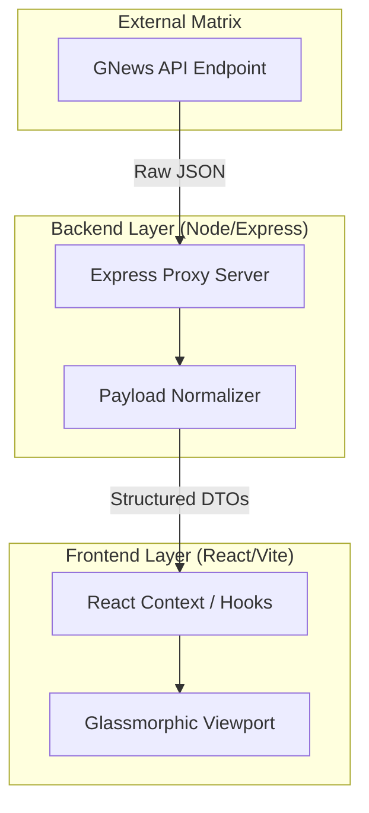
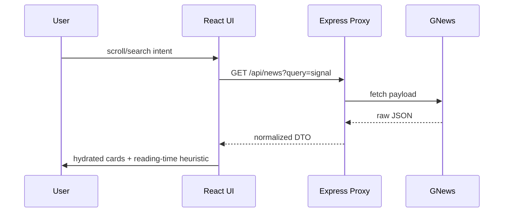

# 🧭 ChaiCode Dev Cohort // Cognitive Flight Deck

[](#)
[](#)
[](#)

> I don't "do assignments." I operate a personal R&D loop. Assumptions are debt; telemetry pays it back.

---

## Operator Snapshot
- **Prime build:** **NeuroNews** — glassmorphic, keyboard-friendly, React/Vite/TS UI fed by an Express proxy that sanitizes GNews before it ever hits the DOM.
- **Second brain:** this repo is a living lab notebook; every folder is either a prototype, a sensory organ, or a muscle group.
- **Time-to-insight:** cold clone ➜ `npm install` ➜ `npm run dev` ➜ data on `localhost:5173` in under 90 seconds.

### Signal at a Glance
| Metric | Current state |
| --- | --- |
| Velocity | 1–2 meaningful commits/day (quality > count) |
| UX Rule | “Pixels must explain themselves in 3s or less.” |
| API Discipline | CORS/keys always proxied; no raw secrets in the client |
| Learning Loop | Build → Measure → Explain → Refactor |

### Quick Teleport
- 🚀 **Run NeuroNews:** `npm install && npm run dev`
- 🧠 **Console lessons:** open `JAVASCRIPT/index.html` → DevTools → Console
- 📜 **Source PDF:** `JAVASCRIPT/JS_Learn_Everything.pdf`
- 🧭 **Backlog brain dump:** see Roadmap below

---

## Launch Codes
- **NeuroNews (current split):**  
  `npm install && npm run dev`  
  `backend/.env` →  
  ```
  PORT=5001
  GNEWS_API_KEY=YOUR_GNEWS_KEY_HERE
  ```
- **NeuroNews (legacy mono):** `cd news-aggregator && npm install && npm run dev`
- **JS chapter pack:** open `JAVASCRIPT/index.html` in a browser/Live Server, then watch DevTools ➜ Console as chapters `01`–`08` run (variables, data types, operators, control flow, loops, functions/closures, arrays, objects). Source reference: `JAVASCRIPT/JS_Learn_Everything.pdf`.

---

## Signal Maps

### System Topology (NeuroNews)

```mermaid
graph TD
    subgraph "External Matrix"
        API["GNews API Endpoint"]
    end
    subgraph "Backend Layer (Node/Express)"
        Proxy["Express Proxy Server"]
        Sanitizer["Payload Normalizer"]
    end
    subgraph "Frontend Layer (React/Vite)"
        State["React Context / Hooks"]
        UI["Glassmorphic Viewport"]
    end
    API -->|Raw JSON| Proxy
    Proxy --> Sanitizer
    Sanitizer -->|Structured DTOs| State
    State --> UI
```

### Data Ingestion Sequence

```mermaid
sequenceDiagram
    participant U as User
    participant F as React UI
    participant B as Express Proxy
    participant E as GNews
    U->>F: scroll/search intent
    F->>B: GET /api/news?query=signal
    B->>E: fetch payload
    E-->>B: raw JSON
    B-->>F: normalized DTO
    F->>U: hydrated cards + reading-time heuristic
```

---

## Lab Inventory (`ls -l`)

| Path | Purpose | Notes |
|---|---|---|
| `frontend/` | NeuroNews UI | Vite + TS + Tailwind + glassmorphic surfaces |
| `backend/` | NeuroNews proxy | CORS/key shielding, DTO sanitation, rate-limit resilience |
| `api/` | Serverless bridge | Vercel-ready handlers mirroring backend routes |
| `assets/` | Visual memory | Concept art + hero imagery |
| `news-aggregator/` | Legacy mono | Original combined build for reference |
| `HTML/` | Fundamentals | Semantic drills and structured markup practice |
| `CSS/` | Visual grammar | Layout systems, spacing logic, rendering control |
| `JAVASCRIPT/` | Behavioral lab | Scope drills, DOM hooks, language micro-experiments |
| `mintlify_clone/` | Perception training | Typographic fidelity + hierarchy practice |
| `cursor_landing_clone/` | Visual ambition | Gradients, masks, layered depth |
| `nike-store/` | Transactional UI | React + Express + Mongo flows; auth & routing discipline |
| `swiftmind/` | AI application | Conversational flows, model integration, product shape |
| `SELF PRACTICE/` | Repetition bank | Iterations that turn reflexes into intuition |
| `Bharat_CV/` | Work with heart | Built for someone I love; craft + care |

---

## Projects, Curated
- **NeuroNews:** headline ingestion, category filters, keyword search, bookmark vault, dark mode, reading-time heuristics, graceful demo fallback when keys throttle.
- **Nike-store:** full-stack commerce sandbox; routing, state, checkout thinking.
- **Swiftmind:** conversational interface experiments; balancing UX with model latency.
- **JavaScript Lab:** tiny, focused drills; everything else graduates out of here.

### Collaboration Signals
- 🧭 Clear briefs before code, short PRs with runnable steps.
- 🧪 Tests or console repros where it matters; screenshots or clips for UI.
- 🛡️ Secrets never in client bundles; envs documented.
- 🛰️ Prefer typed contracts (TS, DTOs) over comment-only agreements.

---

## Operating Principles
- Precision beats volume. I measure twice, commit once.
- Interfaces must earn their pixels; data must justify its trip across the wire.
- Curiosity is tracked like debt—paid back with reproducible models, not vibes.
- Elegance is durability under edge cases, not delicate aesthetics.

---

## Runtime Vitals
```text
SONAM-NARULA.dev :: diagnostics
------------------------------------------------------------
learning_rate          : aggressive
attention_to_detail    : obsessive in the good way
design_sensitivity     : calibrated to human pace
debugging_style        : forensic, timestamped
tolerance_for_sloppy_ui: zero
relationship_with_bugs : adversarial but grateful
mission                : turn effort into craftsmanship
```

---

## If You Skim One Thing
This repo is a cockpit, not a showcase: every directory captures a pattern learned, a mistake avoided, or a sharper mental model. Clone it, run it, break it—then tell me what surprised you.

## Roadmap (near-term vectors)
- Harden NeuroNews with sentiment analysis + Redis cache layer.
- Reduce cold-start to sub-60s with pre-baked env templates.
- Expand JS lab into bite-sized perf experiments (memory, GC, event loop).
- Ship one opinionated design system that survives theme switches without hacks.

---

```
while (alive) {
  learn();
  build();
  refine();
}
```

*This repository is not a portfolio. It's a cockpit for deliberate practice.*
