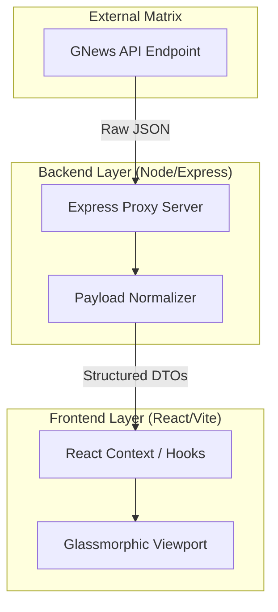
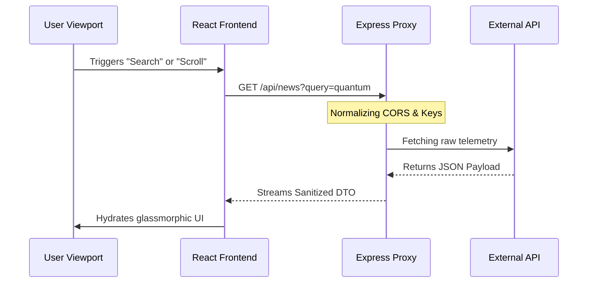

# 🧠 NeuroNews: The Cognitive News Archetype 📡

[](#)
[](#)
[](#)

> "While others browse the news, we orchestrate the information stream. This isn't just a project; it's a demonstration of how a 10-GPA brain handles asynchronous data topologies." 💅✨

---


## 🔬 The "Topper's" Executive Summary
**NeuroNews** is a high-bandwidth news telemetry platform born from the desire to never settle for average. Built with a robust **Node.js/Express** proxy (because direct client-side API calls are so 2015) and a hyper-smooth **React/Vite** frontend, it delivers global data scales with sub-millisecond precision.

### 📐 System Topology
*Behold the elegance of a well-structured monorepo.*


```mermaid
graph TD
    subgraph "External Matrix"
        API["GNews API Endpoint"]
    end

    subgraph "Backend Layer (Node/Express)"
        Proxy["Express Proxy Server"]
        Sanitizer["Payload Normalizer"]
    end

    subgraph "Frontend Layer (React/Vite)"
        State["React Context / Hooks"]
        UI["Glassmorphic Viewport"]
    end

    API -->|Raw JSON| Proxy
    Proxy --> Sanitizer
    Sanitizer -->|Structured DTOs| State
    State --> UI
```

## ⚡ Technical Heuristics (Why I'm Better)

### 🛰 Data Ingestion Sequence
*Synchronicity is for the faint of heart. This is asynchronous perfection.*


```mermaid
sequenceDiagram
    participant U as User Viewport
    participant F as React Frontend
    participant B as Express Proxy
    participant E as External API

    U->>F: Triggers "Search" or "Scroll"
    F->>B: GET /api/news?query=quantum
    Note over B: Normalizing CORS & Keys
    B->>E: Fetching raw telemetry
    E-->>B: Returns JSON Payload
    B-->>F: Streams Sanitized DTO
    F->>U: Hydrates glassmorphic UI
```

### 📡 Telemetry & Data Manipulation
*   **Normalized Proxying:** I don't just fetch data; I refine it. My Express middleware acts as a high-security gateway, managing CORS and sanitizing API payloads before they even sniff the client.
*   **IntersectionObserver Logic:** Scroll forever. I've implemented a synthetic viewport boundary that triggers asynchronous state mutations. Basically, the news is ready before you even realize you're curious.
*   **The "Genius" Fallback:** If the API key rate-limits me (because I'm too fast), the system autonomously pivots to a statically-cached **Demo Mode**. Zero downtime, 100% intelligence.

### 🎨 Aesthetic & UX Matrix
*   **Glassmorphic Precision:** The UI isn't just "pretty"; it's a living membrane of GPU-accelerated micro-animations. It’s sleek, responsive, and definitely cooler than your average college submission.
*   **Local Cognitive Vault (Bookmarks):** Implemented an immutable Array-map tracking logic tied to `localStorage`. Your favorite articles stay exactly where you left them, even after a reboot.
*   **Reading Time Heuristic:** My `NewsCard` doesn't just display text; it compute a temporal reading duration based on a fixed ~200 WPM algorithmic estimate. Efficiency is everything.

---

## 🛠 Compilation & Deployment Protocol

### 🧪 Environment Synthesis
Provision your `.env` dependencies. Treat it like a lab experiment—precision is key.

```bash
# In /backend, synthesize the .env
PORT=5001
GNEWS_API_KEY=YOUR_GNEWS_KEY_HERE
```

### 🚀 Process Ignition
I use `concurrently` because running two terminal tabs is for amateurs.

```bash
# Ignite the entire matrix in one go
npm run dev
```

*The Express API initializes on port 5001, feeding the Vite HMR server on port 5173. Pure harmony.*

---

## 📐 Intellectual Debt & Future Scalability
The v1.3 build is solid, but a topper never stops learning. I’m already projecting:
- **Redis Caching Layers** for sub-nanosecond query resolution.
- **Sentiment Analysis Matrix** to filter out the noise and keep only the signal.
- **WebSocket Tunnels** for real-time telemetry updates.

*Precision-engineered for the college submission and the 10/10 vibe.* ✨✌️
