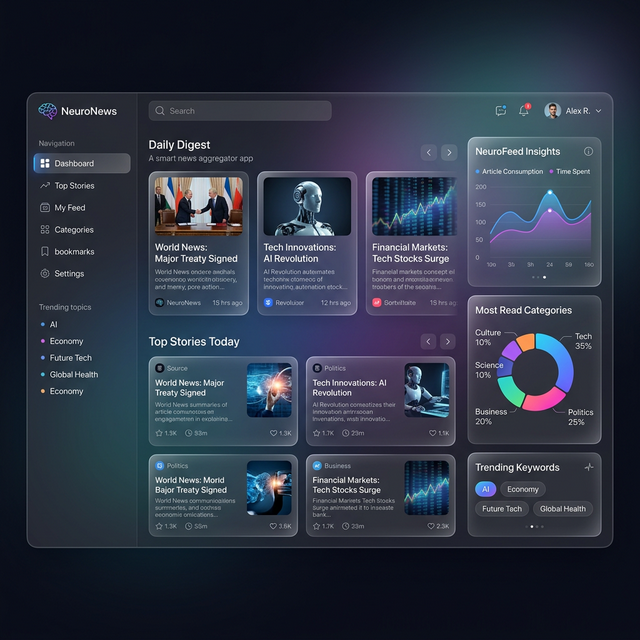
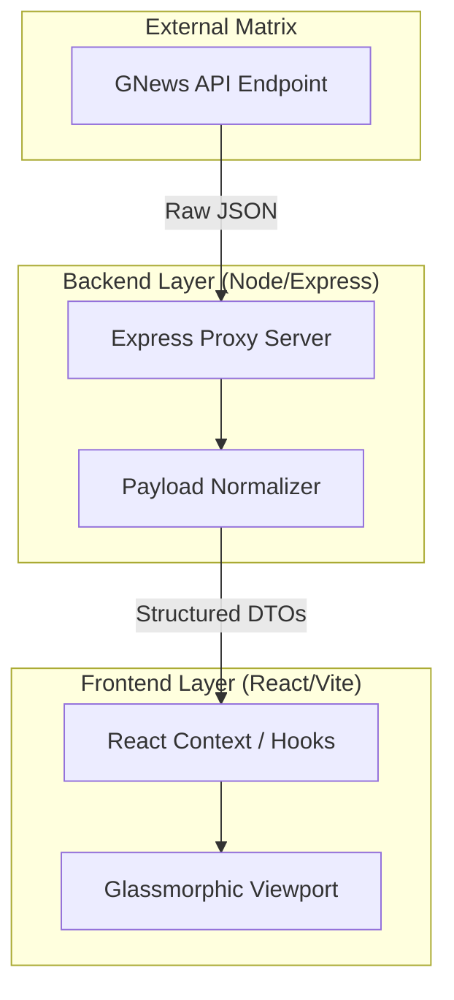

# 🧠 ChaiCode Dev Cohort: The Elite Build Log 📡

<div align="center">

[](#)
[](#)
[](#)
[](#)

> "Average developers follow tutorials. High-signal developers build universes. This repository is my digital neural network, where effort meets craftsmanship." 💅✨

---



</div>

## 🔬 System Executive Summary
This is not a dump of random exercises. It is a record of **cognitive compression**. Every folder represents a point where curiosity turned into implementation: HTML becoming structure, CSS becoming geometry, JavaScript becoming behavior, and React becoming state orchestration.

### 🚀 Prime Project: NeuroNews
A high-bandwidth news telemetry engine built with a robust **Node.js/Express** proxy and a hyper-smooth **React/Vite** client. 
- **Features:** Asynchronous pre-fetching, Infinite Scroll (IntersectionObserver), Local Bookmarks (Immutable Maps), and a self-healing Demo Mode.

---

## 📂 The Directory Matrix (`ls -la`)

| Path | Purpose | Character |
| :--- | :--- | :--- |
| **`frontend/`** | NeuroNews Client | React, Vite, TypeScript, Tailwind |
| **`backend/`** | News Proxy Server | Express, DTO Sanitization, CORS Shielding |
| **`HTML/`** | [Elite Curriculum](file:///Users/sonamnarula/Desktop/COHORT/HTML/index.html) | 8 In-depth modules for total mastery |
| **`JAVASCRIPT/`** | JS Lab Pack | Chapters 01–08 + Console-first experiments |
| **`nike-store/`** | Commerce Sandbox | Transactional UI & Product Flow logic |
| **`swiftmind/`** | AI R&D | Conversational interfaces & LLM design |
| **`clones/`** | Perception Drill | Mintlify & Cursor landing page reconstructions |

---

## 📐 NeuroNews Architecture

```mermaid
graph TD
    subgraph "External Matrix"
        API["GNews API Endpoint"]
    end

    subgraph "Backend Layer (Node/Express)"
        Proxy["Express Proxy Server"]
        Sanitizer["Payload Normalizer"]
    end

    subgraph "Frontend Layer (React/Vite)"
        State["React Context / Hooks"]
        UI["Glassmorphic Viewport"]
    end

    API -->|Raw JSON| Proxy
    Proxy --> Sanitizer
    Sanitizer -->|Structured DTOs| State
    State --> UI
```

---

## 🛠 System Ignition Protocol

```bash
# 1) Synthesize Root Dependencies
npm install

# 2) Provision Backend telemetry
cat > backend/.env <<'EOF'
PORT=5001
GNEWS_API_KEY=YOUR_GNEWS_KEY_HERE
EOF

# 3) Ignite both Cores
npm run dev
# Dashboard: http://localhost:5173 | Telemetry Proxy: http://localhost:5001
```

---

## 📉 System Diagnostics

```text
SONAM-NARULA.dev :: runtime diagnostics
------------------------------------------------------------
learning_rate          : aggressive
attention_to_detail    : unreasonably high
design_sensitivity     : calibrated
debugging_style        : forensic
tolerance_for_sloppy_ui: none
relationship_with_bugs : adversarial but educational
------------------------------------------------------------
mission                : turn effort into craftsmanship
```

---

<div align="center">

```javascript
while (alive) {
  learn();
  build();
  refine();
}
```

*Compiled with discipline, curiosity, and a healthy respect for elegant systems.*

**[View Full Walkthrough](file:///Users/sonamnarula/.gemini/antigravity/brain/42619488-d600-4d44-a213-60809d3098fe/walkthrough.md)**

</div>
