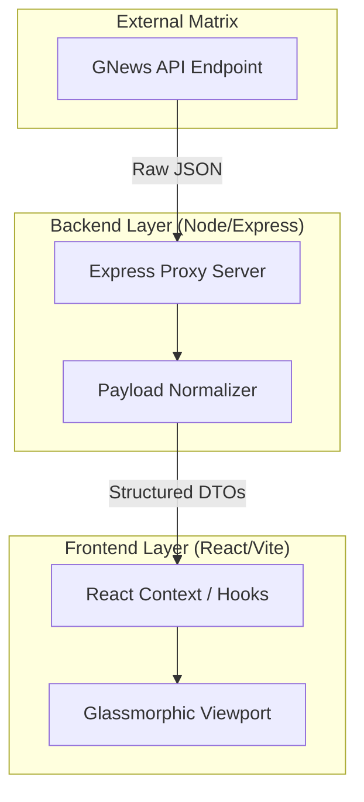
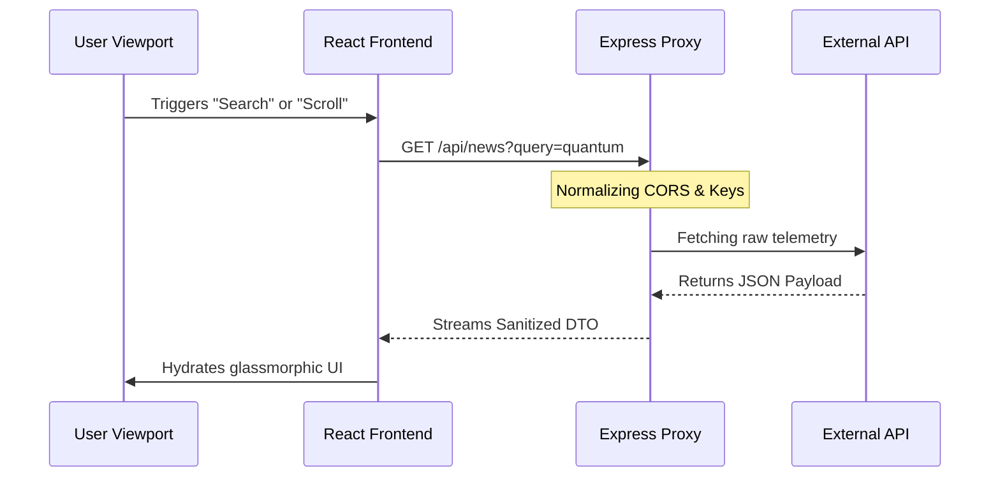

# 🧠 ChaiCode Dev Cohort: The Elite Build Log 📡

[](#)
[](#)
[](#)

> "Average developers follow tutorials. High-signal developers build universes. This repository is my digital neural network, where effort meets craftsmanship." 💅✨

---

## `featured --NeuroNews`


**NeuroNews** is my glassmorphic news intelligence engine: a React/Vite + TypeScript frontend driven by an Express proxy that normalizes GNews payloads before the UI even blinks. It runs as a dual-core system—`frontend/` for the interface, `backend/` for the proxy—and mirrors inside `news-aggregator/` as a legacy snapshot.

### 📐 System Topology

```mermaid
graph TD
    subgraph "External Matrix"
        API["GNews API Endpoint"]
    end

    subgraph "Backend Layer (Node/Express)"
        Proxy["Express Proxy Server"]
        Sanitizer["Payload Normalizer"]
    end

    subgraph "Frontend Layer (React/Vite)"
        State["React Context / Hooks"]
        UI["Glassmorphic Viewport"]
    end

    API -->|Raw JSON| Proxy
    Proxy --> Sanitizer
    Sanitizer -->|Structured DTOs| State
    State --> UI
```

### 🛰 Data Ingestion Sequence

```mermaid
sequenceDiagram
    participant U as User Viewport
    participant F as React Frontend
    participant B as Express Proxy
    participant E as External API

    U->>F: Triggers "Search" or "Scroll"
    F->>B: GET /api/news?query=quantum
    Note over B: Normalizing CORS & Keys
    B->>E: Fetching raw telemetry
    E-->>B: Returns JSON Payload
    B-->>F: Streams Sanitized DTO
    F->>U: Hydrates glassmorphic UI
```

### 🛠 Quick Start
- install once at repo root: `npm install`
- create `backend/.env` with:
  ```bash
  PORT=5001
  GNEWS_API_KEY=YOUR_GNEWS_KEY_HERE
  ```
- run both servers together: `npm run dev` (Concurrently boots backend on **5001** and Vite on **5173**)

### 🎨 UX & Data Notes
- IntersectionObserver powers infinite scroll with pre-fetched state.
- Local bookmarks are immutable map structures pinned to `localStorage`.
- Reading time heuristic estimates ~200 WPM per article for realistic pacing.
- Demo mode snaps in automatically if the API key throttles out—zero downtime.

---

## `whoami`

I am the kind of developer who cannot leave a system half-understood.

If a layout works, I want to know why it works.
If an API breaks, I want the exact point where data stopped being trustworthy.
If a project looks simple from the outside, I want to map the hidden machinery inside it until the abstraction becomes transparent.

This repository is not a dump of random exercises. It is a record of cognitive compression. Every folder here represents a point where curiosity turned into implementation: HTML becoming structure, CSS becoming geometry, JavaScript becoming behavior, React becoming state orchestration, and backend code becoming a negotiation with reality.

I care about elegance, but not the fragile kind. I like systems that survive contact with edge cases. I like interfaces that feel intentional. I like code that reads as if the author respected both the machine and the next human.

---

## `ls`

This repo is a growing local universe of experiments, practice sets, clones, and full-stack builds.

| Path | What It Represents | Technical Character |
|---|---|---|
| `frontend/` | NeuroNews UI | React + Vite + TS, glassmorphic cards, dark mode |
| `backend/` | NeuroNews proxy | Express, CORS/key shielding, DTO sanitization |
| `api/` | Serverless endpoints | Vercel-ready handlers mirroring backend routes |
| `assets/` | Shared visuals | Hero imagery, concept art for NeuroNews |
| `news-aggregator/` | Legacy monorepo snapshot | Original full-stack build with bundled assets |
| `HTML/` | Foundations | Semantic structure, document flow, and markup discipline |
| `CSS/` | Visual mechanics | Layout systems, selectors, spacing logic, and rendering control |
| `JAVASCRIPT/` | Behavioral core | Functions, events, state mutation, and language fundamentals |
| `mintlify_clone/` | UI reconstruction | Clean typography, layout fidelity, and information hierarchy |
| `cursor_landing_clone/` | Visual ambition | Layered effects, gradients, masks, and modern landing page composition |
| `nike-store/` | Full-stack commerce thinking | React frontend, Express backend, MongoDB, auth, and product flows |
| `swiftmind/` | AI application architecture | Client-server separation, model integration, and conversational product design |
| `SELF PRACTICE/` | Iteration zone | Repetition, refinement, and skill-building through applied drills |
| `Bharat_CV/` | Personal work with heart | A practical, respectful build created for someone I love |

---

## `run` quick protocol

- NeuroNews (current): `npm install && npm run dev` at repo root; backend expects `PORT` and `GNEWS_API_KEY` in `backend/.env`.
- NeuroNews (legacy snapshot): `cd news-aggregator && npm install && npm run dev` for the bundled proxy + Vite UI.
- `JAVASCRIPT/`: open `index.html` in a browser (or Live Server) to watch console experiments for `var`/`let`/`const` scope and future micro-tests.

---

## `cat philosophy.txt`

I do not think intelligence in programming is about sounding complicated.

I think it is:

- knowing when a bug is a symptom and not the disease
- respecting fundamentals enough to revisit them without ego
- turning confusion into a reproducible model
- building things that are not only impressive, but legible
- refusing to fake understanding

There is something deeply sincere about programming when it is done properly. You begin with ambiguity. You impose structure. You test your assumptions. You fail in public to the compiler. You return sharper. Over time, your code becomes a visible fossil record of your thinking.

That is what this repository means to me.

---

## `tree -L 2`

### Frontend

- Responsive interfaces with strong attention to spacing, hierarchy, and interaction
- React applications with reusable components and practical state management
- UI cloning as a method of training perception, precision, and design literacy

### Backend

- Express APIs, route handling, controllers, and authentication flows
- Database-backed applications using MongoDB and Mongoose
- Real data pipelines where frontend polish has to coexist with API uncertainty

### Learning Strategy

- Build small things until patterns become internal
- Build bigger things until architecture becomes necessary
- Rebuild ideas in different forms until intuition becomes reliable

---

## `projects --high-signal`

### `NeuroNews` (news-aggregator)

A high-bandwidth news telemetry platform built with React, TypeScript, Vite, Tailwind CSS, and an Express proxy that sanitizes GNews payloads before rendering. Core ideas: latest headlines feed, category filters, keyword search, bookmark vault, dark mode, reading-time heuristics, and a self-healing demo mode when API keys throttle.

Deployment shape:

- **frontend/** & **backend/** for the current split build (run with `npm run dev`).
- **api/** for Vercel serverless compatibility.
- **news-aggregator/** retains the original monorepo with assets for reference.

### `JAVASCRIPT`

A lightweight sandbox to cement language fundamentals: scope rules for `var`/`let`/`const`, quick DOM hooks, and a playground for future micro-experiments before they graduate into larger apps.

### `nike-store`

A full-stack e-commerce build focused on state, routing, APIs, and backend-connected user flows. This is where UI stopped being decorative and started becoming transactional.

### `swiftmind`

An AI-flavored application exploring conversational interfaces, model-backed interactions, and the practical shape of LLM product design.

---

## `system status`

```text
SONAM-NARULA.dev :: runtime diagnostics
------------------------------------------------------------
learning_rate          : aggressive
attention_to_detail    : unreasonably high
design_sensitivity     : calibrated
debugging_style        : forensic
tolerance_for_sloppy_ui: none
relationship_with_bugs : adversarial but educational
compiler_feedback      : welcome
------------------------------------------------------------
mission                : turn effort into craftsmanship
```

---

## `future roadmap`

I want this repository to keep evolving into something more than a course log.

I want it to become:

- evidence of technical depth
- proof of consistency
- a map of how I think
- a body of work that feels both human and rigorous

If someone reads this README, I want them to understand one thing very clearly:

I care.
I care about the details.
I care about the architecture under the surface.
I care about building things well.
And I care enough to keep getting better.

---

<div align="center">

```text
while (alive) {
  learn();
  build();
  refine();
}
```

*Compiled with discipline, curiosity, and a healthy respect for elegant systems.*

</div>
